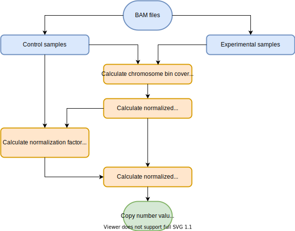

# CNV_Me
Copy number variation (CNV) caller to detect large-scale structural variation using BAM (.bam) files as input. <br>

## Workflow


`CNV_Me` workflow: <br>  
#### 1. Distinguishes control from experimental samples by referencing the sample info file. <br>
For each control and experimental sample: <br>

#### 2. Calculates the coverage per bin in each chromosome. <br><br>
 <br>

#### 3. Calculates the normalized bin coverage. <br><br>
 <br>

#### 4. Calculates the normalization factors of autosomal and sex chromosomes for male and female samples. <br><br>
 <br><br>

 <br><br>

 <br><br>

 <br>

#### 5. Calculates normalized copy numbers. <br><br>
 <br>

## Command line arguments
1. `--samplesDir` <path> Path to a directory containing all BAM file samples or subdirectories of BAM files. <br>
2. `--binSize` <int> Size of bin in base pair. Default is 1000. <br>
3. `--sampleInfo` <path> Path to a sample info .csv file. Must contain `Diagnosis` and `Sex` columns. <br>
4. `--controlName` <str> Name of the control class in `Diagnosis` column of sample info file. Default is "Control".

## Usage example
On the Barbera cluster at UC Davis:
```
module load anaconda3/4.5.12
python3 cnv_caller.py --samplesDir ./ --bin 50000 --sampleInfo ./sampleInfo.csv --ControlName "TypicalDevelopment"
```

## Output
1. `CNV_Me_[current date and time].print` All print statments are recorded in this file. <br>
2. `CNV_Me_output_[current date and time].txt` Output tab-delimited file of normalized CNV values for each bin of each chromosome of each sample. The first three columns are always `chr`, `start`, and `end`. The following columns include all control samples and then all experimental samples. The rows represent each chromosome bin that was found across all control and experimental samples.

## Example of output file
| chr | start | end | control_sample_1 | control_sample_2 | experimental_sample_1 | experimental_sample_2 |
| --------------- | --------------- | --------------- | --------------- | --------------- | --------------- | --------------- |
| chr1 | 10000 | 15000 | 2.217 | 2.283 | 1.627 | 1.504 |
| ... | ... | ... | ... | ... | ... | ... |
| chrY | 2785000 | 2790000 | 1.11 |	1.038 | 1.054	| 0.814|
